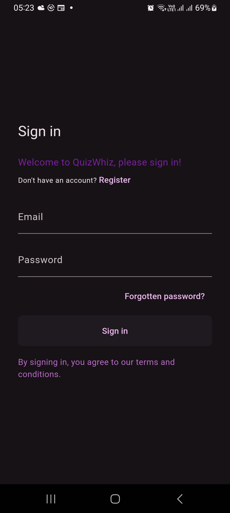
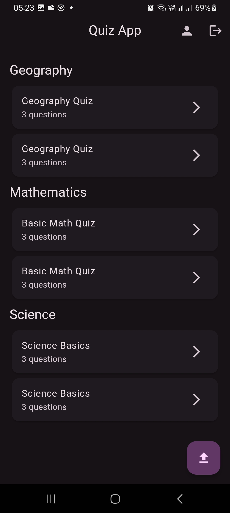
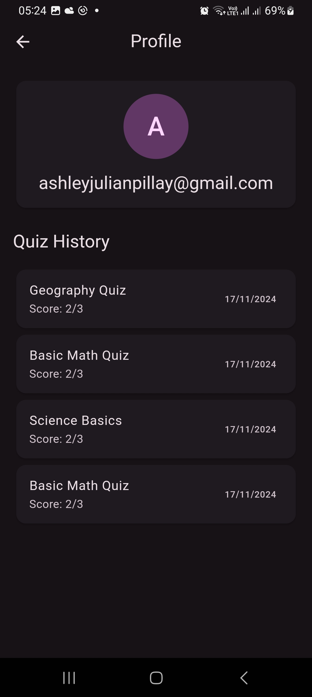

# 📚 QuizWhiz - Flutter Quiz App

A modern, engaging quiz application built with Flutter and Firebase. QuizWhiz helps you test your knowledge across various subjects with an intuitive and beautiful interface.

## ✨ Features

- 🔐 **Secure Authentication** - Email/password authentication using Firebase Auth
- 💾 **Cloud Storage** - All quizzes and results are stored in Firebase Cloud Firestore
- 🎨 **Beautiful UI** - Clean, modern interface with Material Design 3
- 📱 **Responsive Design** - Works seamlessly on both mobile and tablet devices
- ✏️ **Quiz Categories** - Multiple subjects with varied questions
- 🔍 **Quick Access** - Easy to start quizzes and track progress
- 🌈 **Custom Theme** - Beautiful purple theme with consistent styling

## 📱 Screenshots

<div style="display: flex; justify-content: space-between;">
  
  
  
  
  
  
</div>

## 🚀 Getting Started

### Prerequisites

- **Flutter** (2.0 or higher)
- **Firebase account**
- **Firebase CLI**

### Installation

1. Clone the repository
```bash
git clone https://github.com/apillay1992/QuizWhiz.git
```

2. Install dependencies
```bash
flutter pub get
```

3. Configure Firebase
    * Create a new Firebase project
    * Enable Authentication and Cloud Firestore
    * Download and add your `google-services.json` (Android) and `GoogleService-Info.plist` (iOS)
    * Update Firebase configuration in `lib/firebase_options.dart`

4. Run the app
```bash
flutter run
```

## 🏗️ Architecture
The app follows a clean architecture pattern with:

* **Models**: Data classes (e.g., QuizModel, QuestionModel)
* **Screens**: UI components and logic
* **Utils**: Helper functions and services
* **Firebase** Integration: Backend services

## 🛠️ Built With
* Flutter - UI framework
* Firebase - Backend and Authentication
* Cloud Firestore - Database
* Firebase Auth - Authentication

## 📄 License

This project is licensed under the MIT License - see the [LICENSE](LICENSE) file for details.

## 🤝 Contributing

Contributions are welcome! Please feel free to submit a Pull Request.

1. Fork the Project
2. Create your Feature Branch (`git checkout -b feature/AmazingFeature`)
3. Commit your Changes (`git commit -m 'Add some AmazingFeature'`)
4. Push to the Branch (`git push origin feature/AmazingFeature`)
5. Open a Pull Request

## 📞 Contact
Ashley Pillay - @apillay1992
Project Link: https://github.com/apillay1992/QuizWhiz